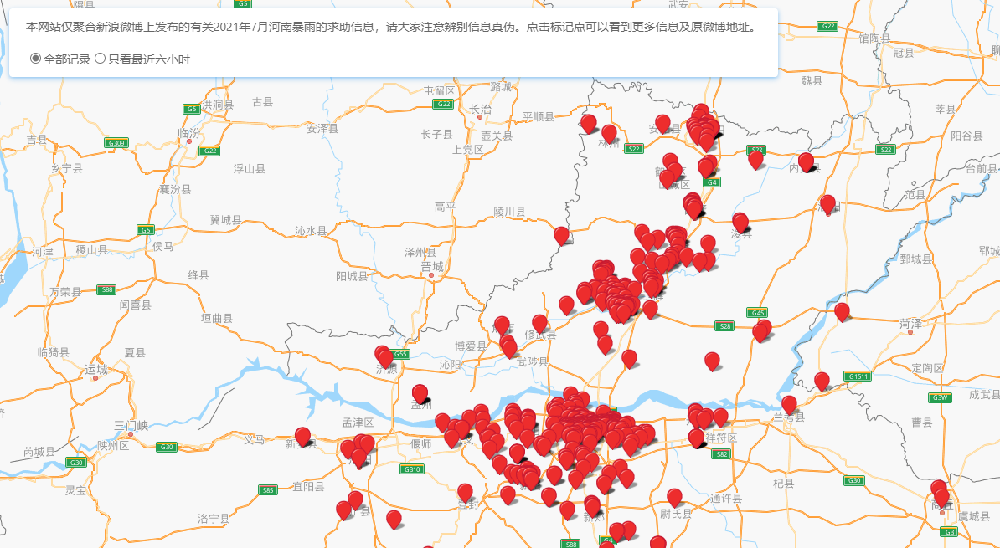

河南暴雨求助微博的地图可视化项目：https://henan.tianshili.me/

## 关于本项目
我们通过爬虫把带有#河南暴雨求助#等相关微博获取后，使用本项目进行可视化，希望可以通过地图上的分布帮助到更多的人了解灾情的进展。

## 在本地运行
`yarn install && yarn start`

## 参与贡献
- 请求新的feature可以加上todo标识提交issues
- 对于存在的问题和bug加上bug标识直接提交issues
- 想要贡献自己代码的同学可以直接clone提交pull request